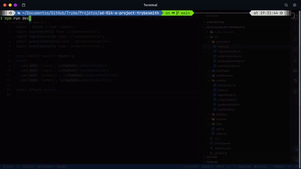

# Trybesmith

## 📷 Screenshot

  

## 📋 Descrição do projeto

Uma simulação de requisições à uma API de itens medievais, utilizando Typescript com arquitetura CRUD (Create, Read, Update e Delete). Contém vários endpoints que irão ler e escrever em um banco de dados, utilizando o MySQL.

  

## 💻 Tecnologias utilizadas

- TypeScript

- MySQL/Express

- Joi/JWT

##  :inbox_tray: Para rodar este projeto
1. Tenha node, MySQL Server e o Git instalados e configurados em sua máquina.
2.  Vá na pasta em que irá baixar o projeto, abra o terminal e clone o projeto: `git clone git@github.com:Dogl4/trybesmith.git`
3. Vá para a pasta raiz do projeto, rode: `npm install`. Cópie o conteúdo do arquivo: `Trybesmith.sql`, crie o banco com workbench.
4. No terminal rode `npm run dev`
5.  Use algum dos seguintes programas para fazer a requisição:  [Thunder Client](https://www.thunderclient.com/) ou [Postman](https://www.postman.com/) ou [Insomnia](https://insomnia.rest/).
6. Faça a requisição para os endpoints abaixo.

## :balloon: Endpoints
- POST - `/user`
- POST - `/login`
- GET - `/products`
- POST - `/products`
- GET - `/orders`
- GET - `/orders/:id`
- POST - `/orders`

## 📈 Status do projeto

✅ Concluído

  

## :busts_in_silhouette: Contribuintes

  

Estas pessoas participaram deste projeto:

  

<table>

<tr  style="width:120px">

<td  align="center">

<a  target=”_blank”  href="https://github.com/Dogl4">

 

<b>Pedro Barreto</b>

</a>

</td>

<td  align="center">

<a  target=”_blank”  href="https://github.com/betrybe">

 

<b>Trybe</b>

</a>

</td>

</tr>

<td  width="120px;">

Desenvolvimento do código.

</td>

<td  width="120px;">

Ideia e estrutura do banco.

</td>

</th>

</table>

  
  

<!--

## 🚀 Links

- Design do projeto no Figma: [Link]()

- Site em produção: [Link]() -->
